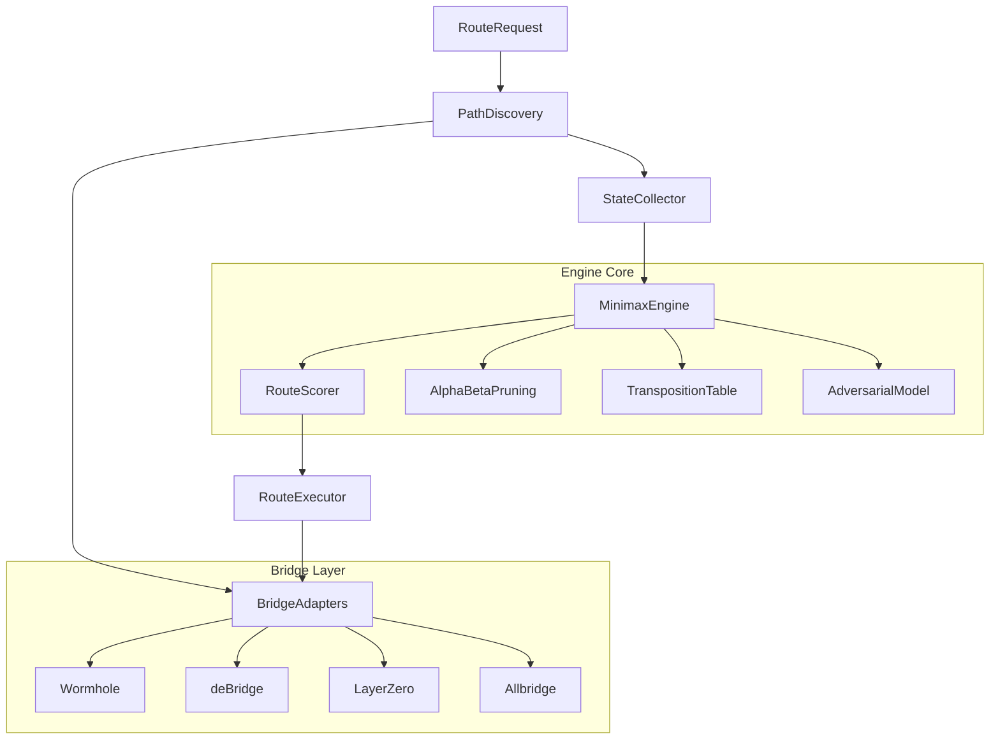

<p align="center">
  
</p>

# MNMX

[](https://github.com/MEMX-labs/MNMX/actions)
[](./LICENSE)
[](https://www.rust-lang.org/)
[](https://www.typescriptlang.org/)
[](https://www.python.org/)
[](https://mnmx.app)
[](https://x.com/mnmxapp)
[](https://mnmx.app/docs)

---

**Minimax-optimal cross-chain routing. Evaluate every path, guarantee the best worst-case outcome.**

Every cross-chain transfer is a game against market conditions. Slippage spikes. Gas surges. Bridge congestion. MEV extraction. Most aggregators optimize for the best case — MNMX optimizes for the **worst case** and guarantees you the best floor.

MNMX applies the same class of algorithms that defeated world champions in chess to cross-chain route optimization. The engine enumerates every possible path across bridges, models adversarial market conditions at each hop, and uses **minimax search with alpha-beta pruning** to find the route that maximizes your guaranteed minimum outcome.

The key insight: bridge routing is structurally isomorphic to game tree search. Your moves are route choices. The opponent's moves are worst-case market conditions. The minimax algorithm finds the path that remains optimal even when everything goes wrong.

## Why Minimax

Every other aggregator uses **expected value** optimization — pick the route with the highest average outcome. This works when conditions are stable. It fails catastrophically when they're not.

| | Expected Value | Minimax |
|---|---|---|
| Optimizes for | Average case | Worst case |
| When conditions are good | Similar results | Similar results |
| When conditions are bad | Catastrophic loss | **Best guaranteed floor** |
| Large transfers | High variance | **Low variance** |
| Bridge congestion | Unpredictable | **Predictable** |

Consider a $100K transfer with two routes:
- **Route A**: Expected output $99,500. Worst case: $96,200.
- **Route B**: Expected output $99,200. Worst case: $98,800.

Expected-value optimization picks Route A. Minimax picks Route B. When the bridge gets congested and slippage doubles, Route A loses $3,800. Route B loses $1,200. The difference is **$2,600 in guaranteed savings**.

## Architecture



### Multi-Language Architecture

| Language | Directory | Role |
|----------|-----------|------|
| **Rust** | `engine/` | Core search engine. Minimax with alpha-beta pruning, route scoring, path discovery, transposition table. Sub-millisecond search across thousands of candidate paths. |
| **TypeScript** | `src/` | SDK and bridge integration layer. MnmxRouter, bridge adapters (Wormhole, deBridge, LayerZero, Allbridge), chain configurations, route execution. |
| **Python** | `sdk/python/` | Research and simulation toolkit. Route simulator, Monte Carlo analysis, batch strategy comparison, CLI. |

### Data Flow

1. **PathDiscovery** enumerates all viable paths between source and destination — direct bridges, 2-hop paths through intermediate chains, 3-hop paths through multiple intermediaries. A transfer from Ethereum to Solana might discover 15+ candidate paths across different bridge combinations.

2. **StateCollector** gathers real-time market data for each path segment — gas prices, bridge liquidity, congestion levels, recent success rates, token prices.

3. **MinimaxEngine** models each path as a game tree. Your move: choose a route. The adversary's move: worst-case market conditions (slippage spike, gas surge, bridge delay, MEV extraction). The engine searches this tree with alpha-beta pruning to find the route with the **best guaranteed minimum outcome**.

4. **RouteScorer** evaluates every leaf across five weighted dimensions:

| Dimension | Weight | What it captures |
|-----------|--------|------------------|
| Fees | 0.25 | Bridge fees + gas costs across all hops |
| Slippage | 0.25 | Price impact relative to liquidity depth |
| Speed | 0.15 | Total estimated transfer time |
| Reliability | 0.20 | Historical bridge success rate |
| MEV Exposure | 0.15 | Probability-weighted adversarial extraction |

5. **RouteExecutor** executes the optimal route, monitoring each hop and handling failures with automatic fallback.

### Adversarial Model

The adversarial model controls worst-case estimation. Every quoted value gets multiplied by a worst-case factor:

| Parameter | Default | What it models |
|-----------|---------|----------------|
| `slippageMultiplier` | 2.0x | Quoted slippage doubles |
| `gasMultiplier` | 1.5x | Gas price surges 50% |
| `bridgeDelayMultiplier` | 3.0x | Bridge takes 3x longer |
| `mevExtraction` | 0.3% | MEV bots extract 0.3% of value |
| `priceMovement` | 0.5% | Token price moves 0.5% against you |

Higher multipliers = more conservative routing. The engine will prefer routes with lower variance over routes with higher expected value. This is appropriate when protecting large transfers.

### Engine Performance

| Property | Value | Context |
|----------|-------|---------|
| Candidate paths | 10-50 | Per chain pair, across all bridge combinations |
| Search nodes | 500-5,000 | Alpha-beta pruning eliminates 90%+ of the search space |
| Search latency | <10 ms | Rust engine, cache-optimized |
| Supported chains | 8 | Ethereum, Solana, Arbitrum, Base, Polygon, BNB, Optimism, Avalanche |
| Supported bridges | 4 | Wormhole, deBridge, LayerZero, Allbridge |

## Quick Start

```bash
git clone https://github.com/MEMX-labs/MNMX.git
cd MNMX
npm ci
npm run build
npm test
```

## Usage

```typescript
import { MnmxRouter } from '@mnmx/core';

const router = new MnmxRouter({
  strategy: 'minimax',
  slippageTolerance: 0.5,
});

// Find the optimal route
const route = await router.findRoute({
  from: { chain: 'ethereum', token: 'ETH', amount: '1.0' },
  to:   { chain: 'solana',   token: 'SOL' },
});

console.log(route.path);              // Route hops
console.log(route.expectedOutput);    // Best-case output
console.log(route.guaranteedMinimum); // Minimax worst-case output
console.log(route.estimatedTime);     // Expected transfer time
console.log(route.totalFees);         // Total fees across all hops

// Execute the route
const result = await router.execute(route, { signer });
console.log(result.txHash);
console.log(result.actualOutput);
```

### Strategy Profiles

```typescript
// Minimax (default) -- best guaranteed minimum outcome
const router = new MnmxRouter({ strategy: 'minimax' });

// Cheapest -- minimize total fees
const router = new MnmxRouter({ strategy: 'cheapest' });

// Fastest -- minimize transfer time
const router = new MnmxRouter({ strategy: 'fastest' });

// Safest -- maximize bridge reliability
const router = new MnmxRouter({ strategy: 'safest' });
```

| Strategy | Fees | Slippage | Speed | Reliability | MEV | Use Case |
|----------|------|----------|-------|-------------|-----|----------|
| **minimax** | 0.25 | 0.25 | 0.15 | 0.20 | 0.15 | Best guaranteed outcome (default) |
| **cheapest** | 0.45 | 0.30 | 0.05 | 0.10 | 0.10 | Minimize total cost |
| **fastest** | 0.10 | 0.15 | 0.50 | 0.15 | 0.10 | Minimize transfer time |
| **safest** | 0.10 | 0.15 | 0.10 | 0.40 | 0.25 | Maximize security |

### Compare Routes

```typescript
const routes = await router.findAllRoutes({
  from: { chain: 'ethereum', token: 'ETH', amount: '1.0' },
  to:   { chain: 'solana',   token: 'SOL' },
});

for (const route of routes) {
  console.log(`${route.path.join(' -> ')}`);
  console.log(`  Expected: ${route.expectedOutput} SOL`);
  console.log(`  Minimum:  ${route.guaranteedMinimum} SOL`);
  console.log(`  Fees:     ${route.totalFees}`);
  console.log(`  Time:     ${route.estimatedTime}`);
}
```

### Python SDK

```python
from mnmx import MnmxRouter, RouteSimulator

router = MnmxRouter(strategy="minimax")

route = router.find_route(
    from_chain="ethereum",
    from_token="ETH",
    amount="1.0",
    to_chain="solana",
    to_token="SOL",
)

# Monte Carlo simulation
sim = RouteSimulator()
mc = sim.monte_carlo(route=route, iterations=10_000, seed=42)

print(f"Mean output: {mc.mean_output:.4f} SOL")
print(f"5th percentile: {mc.percentile_5:.4f} SOL")
print(f"Worst observed: {mc.min_output:.4f} SOL")
```

### Custom Bridge

```typescript
import { BridgeAdapter } from '@mnmx/core';

class MyBridgeAdapter implements BridgeAdapter {
  name = 'my-bridge';
  supportedChains = ['ethereum', 'solana', 'arbitrum'];

  async getQuote(params) {
    const response = await fetch(`https://api.mybridge.com/quote?...`);
    const data = await response.json();
    return {
      bridge: this.name,
      inputAmount: params.amount,
      outputAmount: data.outputAmount,
      fee: data.fee,
      estimatedTime: data.estimatedTime,
      liquidityDepth: data.availableLiquidity,
      expiresAt: Date.now() + 30_000,
    };
  }
  // ... implement execute, getStatus, getHealth
}

router.registerBridge(new MyBridgeAdapter());
```

## Supported Chains

| Chain | Bridges Available |
|-------|-------------------|
| Ethereum | Wormhole, deBridge, LayerZero, Allbridge |
| Solana | Wormhole, deBridge, Allbridge |
| Arbitrum | Wormhole, deBridge, LayerZero |
| Base | Wormhole, LayerZero |
| Polygon | Wormhole, LayerZero, Allbridge |
| BNB Chain | deBridge, LayerZero, Allbridge |
| Optimism | Wormhole, LayerZero |
| Avalanche | Wormhole, LayerZero, Allbridge |

## API Reference

Full API documentation: **[mnmx.app/docs](https://mnmx.app/docs)**

### Core Classes

| Class | Purpose |
|-------|---------|
| `MnmxRouter` | Main entry point -- route discovery, optimization, and execution |
| `MinimaxEngine` | Core search engine -- minimax with alpha-beta pruning |
| `PathDiscovery` | Enumerate all candidate paths across bridges |
| `RouteScorer` | Multi-dimensional route evaluation |
| `BridgeAdapter` | Interface for bridge integrations |
| `RouteSimulator` | Simulate routes under adversarial conditions (Python) |

## References

- Von Neumann, J. (1928). "Zur Theorie der Gesellschaftsspiele." *Mathematische Annalen*, 100(1), 295-320.
- Shannon, C. E. (1950). "Programming a Computer for Playing Chess." *Philosophical Magazine*, 41(314).
- Knuth, D. E. & Moore, R. W. (1975). "An Analysis of Alpha-Beta Pruning." *Artificial Intelligence*, 6(4), 293-326.

## Links

- Website: [mnmx.app](https://mnmx.app)
- Documentation: [mnmx.app/docs](https://mnmx.app/docs)
- GitHub: [github.com/MEMX-labs/MNMX](https://github.com/MEMX-labs/MNMX)
- Twitter: [x.com/mnmxapp](https://x.com/mnmxapp)

## License

[MIT](./LICENSE) -- Copyright (c) 2026 MNMX Protocol
