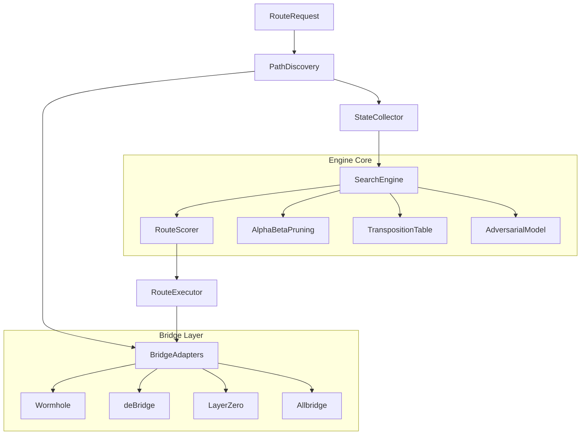

<p align="center">
  
</p>

# MNMX

<p align="center">
  <a href="https://github.com/MEMX-labs/mnmx/actions"></a>
  <a href="./LICENSE"></a>
  <a href="https://github.com/MEMX-labs/mnmx"></a>
  <a href="https://github.com/MEMX-labs/mnmx"></a>
  <a href="https://www.rust-lang.org/"></a>
  <a href="https://www.typescriptlang.org/"></a>
  <a href="https://www.python.org/"></a>
  <a href="https://mnmx.app"></a>
  <a href="https://x.com/mnmxapp"></a>
  <a href="https://mnmx.app/docs"></a>
</p>

---

**Cross-chain routing that optimizes for the worst case, not the best case.**

Cross-chain transfers are unreliable. Bridges go down mid-transfer. Slippage spikes when you need liquidity most. Gas prices surge between the time you quote and the time you execute. MEV bots front-run your transaction on the destination chain. Every aggregator today picks the route that looks cheapest *right now* — and you eat the loss when conditions shift.

MNMX is a cross-chain routing engine that treats market conditions as adversarial. Instead of optimizing for expected output, it searches across all candidate paths — direct bridges, multi-hop routes through intermediate chains, split-amount strategies — and selects the route that **maximizes your guaranteed minimum outcome** even under worst-case slippage, gas, and bridge delay.

## The Problem

A $100K USDC transfer from Ethereum to Solana has 12+ candidate paths across 4 bridges, including 2-hop routes through Arbitrum, Base, and Polygon. Current aggregators rank these by expected output. That ranking changes the moment conditions shift:

```
Route A (Wormhole direct)       → Expected: $99,500 | If slippage 2x: $96,200
Route B (deBridge direct)       → Expected: $99,200 | If slippage 2x: $98,800
Route C (LZ→Arb + Wormhole→Sol) → Expected: $99,050 | If slippage 2x: $98,400
```

An expected-value optimizer picks Route A. MNMX picks Route B — $2,600 more in the worst case. For institutional transfers, protocol treasuries, and DAO operations, that difference compounds.

## How It Works

MNMX models cross-chain routing as a **constrained search problem** where each hop introduces independent adversarial uncertainty. The engine builds a search tree of all candidate paths (direct, 2-hop, 3-hop), applies worst-case multipliers to each hop independently, scores every resulting leaf across five dimensions, and prunes dominated branches early via alpha-beta search.

### Why this requires search, not sorting

A naive approach — score each route and sort — works for single-hop direct bridges. But multi-hop routes have **combinatorial interactions**: the worst case for hop 1 affects the input to hop 2, which compounds with the worst case for hop 2. With 4 bridges × 8 chains × 3 hop depths, the candidate space grows to thousands of paths. Alpha-beta pruning eliminates 90%+ of these without evaluating them, keeping search under 10ms.

```
Chains(8) × Bridges(4) × MaxHops(3) = 3,000+ candidate paths
After alpha-beta pruning:            ~200-500 evaluated
Search latency:                       <10 ms (Rust engine)
```

### Architecture



### Data Flow

1. **PathDiscovery** enumerates all viable paths: direct bridges, 2-hop routes through intermediate chains (ETH→Arbitrum→Solana), and 3-hop routes when no direct path exists. Each path is a sequence of (bridge, fromChain, toChain) segments.

2. **StateCollector** fetches real-time data for each segment — gas prices from chain RPCs, bridge liquidity from bridge APIs, recent success rates, and token prices.

3. **SearchEngine** builds a search tree where each level represents a hop. At each hop, the adversarial model applies worst-case multipliers independently (slippage could 2x on hop 1, gas could surge on hop 2). The engine searches this tree with alpha-beta pruning to find the path with the best guaranteed floor.

4. **RouteScorer** evaluates each candidate across five weighted dimensions:

| Dimension | Weight | Source |
|-----------|--------|--------|
| Fees | 0.25 | Bridge protocol fees + gas costs across all hops |
| Slippage | 0.25 | Price impact computed from on-chain liquidity depth |
| Speed | 0.15 | Sum of estimated confirmation times per hop |
| Reliability | 0.20 | Bridge success rate from historical data |
| MEV Exposure | 0.15 | Probability-weighted adversarial extraction risk |

5. **RouteExecutor** submits the selected route on-chain, monitoring each hop and triggering fallback paths if a bridge fails mid-transfer.

### Adversarial Model

Each quoted value gets stress-tested with a worst-case multiplier before scoring:

| Parameter | Default | Effect |
|-----------|---------|--------|
| `slippageMultiplier` | 2.0x | Quoted slippage doubles at each hop |
| `gasMultiplier` | 1.5x | Gas price surges 50% between quote and execution |
| `bridgeDelayMultiplier` | 3.0x | Bridge takes 3x longer (affects time-sensitive transfers) |
| `mevExtraction` | 0.3% | MEV bots extract 0.3% of transfer value |
| `priceMovement` | 0.5% | Token price moves 0.5% against you during transfer |

These multipliers are configurable. Higher values = more conservative routing, appropriate for large transfers. Lower values = more aggressive routing for small, time-sensitive transfers.

### Multi-Language Architecture

| Language | Directory | Role |
|----------|-----------|------|
| **Rust** | `engine/` | Core search engine — path enumeration, alpha-beta pruning, transposition table, route scoring. Processes thousands of candidate paths in <10ms. |
| **TypeScript** | `src/` | SDK and bridge integration — MnmxRouter, bridge adapters (Wormhole, deBridge, LayerZero, Allbridge), chain configs, route execution. |
| **Python** | `sdk/python/` | Research and analysis — Monte Carlo simulation, batch strategy comparison, route visualization, CLI. |

## Quick Start

```bash
git clone https://github.com/MEMX-labs/mnmx.git
cd mnmx
npm install
npm run build
npm test
```

## Usage

```typescript
import { MnmxRouter } from '@mnmx/core';

const router = new MnmxRouter({
  strategy: 'minimax',
  slippageTolerance: 0.5,
});

// Find the optimal route
const route = await router.findRoute({
  from: { chain: 'ethereum', token: 'USDC', amount: '100000' },
  to:   { chain: 'solana',   token: 'USDC' },
});

console.log(route.path);              // Route hops
console.log(route.expectedOutput);    // Best-case output
console.log(route.guaranteedMinimum); // Worst-case guaranteed output
console.log(route.estimatedTime);     // Expected transfer time
console.log(route.totalFees);         // Total fees across all hops

// Execute the route
const result = await router.execute(route, { signer });
console.log(result.txHash);
console.log(result.actualOutput);
```

### Strategy Profiles

```typescript
// Minimax (default) — best guaranteed minimum outcome
const router = new MnmxRouter({ strategy: 'minimax' });

// Cheapest — minimize total fees (higher variance)
const router = new MnmxRouter({ strategy: 'cheapest' });

// Fastest — minimize transfer time
const router = new MnmxRouter({ strategy: 'fastest' });

// Safest — maximize bridge reliability
const router = new MnmxRouter({ strategy: 'safest' });
```

| Strategy | Fees | Slippage | Speed | Reliability | MEV | Use Case |
|----------|------|----------|-------|-------------|-----|----------|
| **minimax** | 0.25 | 0.25 | 0.15 | 0.20 | 0.15 | Large transfers, treasury ops |
| **cheapest** | 0.45 | 0.30 | 0.05 | 0.10 | 0.10 | Small transfers, cost-sensitive |
| **fastest** | 0.10 | 0.15 | 0.50 | 0.15 | 0.10 | Time-critical arbitrage |
| **safest** | 0.10 | 0.15 | 0.10 | 0.40 | 0.25 | High-value, risk-averse |

### Compare Routes

```typescript
const routes = await router.findAllRoutes({
  from: { chain: 'ethereum', token: 'USDC', amount: '100000' },
  to:   { chain: 'solana',   token: 'USDC' },
});

for (const route of routes) {
  console.log(`${route.path.join(' → ')}`);
  console.log(`  Expected:   ${route.expectedOutput} USDC`);
  console.log(`  Guaranteed: ${route.guaranteedMinimum} USDC`);
  console.log(`  Fees:       ${route.totalFees}`);
  console.log(`  Time:       ${route.estimatedTime}s`);
}
```

### Python SDK

```python
from mnmx import MnmxRouter, RouteSimulator

router = MnmxRouter(strategy="minimax")

route = router.find_route(
    from_chain="ethereum",
    from_token="USDC",
    amount="100000",
    to_chain="solana",
    to_token="USDC",
)

# Monte Carlo simulation — run 10K scenarios with randomized market conditions
sim = RouteSimulator()
mc = sim.monte_carlo(route=route, iterations=10_000, seed=42)

print(f"Mean output:    {mc.mean_output:.2f} USDC")
print(f"5th percentile: {mc.percentile_5:.2f} USDC")
print(f"Worst observed: {mc.min_output:.2f} USDC")
```

### Custom Bridge Adapter

```typescript
import { BridgeAdapter } from '@mnmx/core';

class MyBridgeAdapter implements BridgeAdapter {
  name = 'my-bridge';
  supportedChains = ['ethereum', 'solana', 'arbitrum'];

  async getQuote(params) {
    const response = await fetch(`https://api.mybridge.com/quote?...`);
    const data = await response.json();
    return {
      bridge: this.name,
      inputAmount: params.amount,
      outputAmount: data.outputAmount,
      fee: data.fee,
      estimatedTime: data.estimatedTime,
      liquidityDepth: data.availableLiquidity,
      expiresAt: Date.now() + 30_000,
    };
  }
  // ... implement execute, getStatus, getHealth
}

router.registerBridge(new MyBridgeAdapter());
```

## Supported Chains & Bridges

| Chain | Bridges |
|-------|---------|
| Ethereum | Wormhole, deBridge, LayerZero, Allbridge |
| Solana | Wormhole, deBridge, Allbridge |
| Arbitrum | Wormhole, deBridge, LayerZero |
| Base | Wormhole, LayerZero |
| Polygon | Wormhole, LayerZero, Allbridge |
| BNB Chain | deBridge, LayerZero, Allbridge |
| Optimism | Wormhole, LayerZero |
| Avalanche | Wormhole, LayerZero, Allbridge |

## API Reference

Full documentation: **[mnmx.app/docs](https://mnmx.app/docs)**

| Class | Purpose |
|-------|---------|
| `MnmxRouter` | Main entry point — route discovery, optimization, and execution |
| `PathDiscovery` | Enumerate all candidate paths (direct, multi-hop) across bridges |
| `RouteScorer` | Multi-dimensional weighted route evaluation |
| `BridgeAdapter` | Interface for adding new bridge integrations |
| `RouteSimulator` | Monte Carlo simulation under adversarial conditions (Python) |

## Project Structure

```
mnmx/
├── engine/              Rust core — alpha-beta search, scoring, transposition table
│   └── src/
│       ├── search.rs        minimax search with pruning
│       ├── scoring.rs       5-dimension route evaluation
│       ├── adversarial.rs   worst-case scenario generator
│       └── table.rs         transposition table (Zobrist hashing)
├── src/                 TypeScript SDK — router, bridge adapters, execution
│   ├── router/
│   │   ├── minimax.ts       search engine orchestration
│   │   ├── scoring.ts       route scoring and normalization
│   │   └── path-discovery.ts  candidate path enumeration
│   ├── bridges/
│   │   ├── wormhole.ts      Wormhole guardian network adapter
│   │   ├── debridge.ts      deBridge DLN adapter
│   │   ├── layerzero.ts     LayerZero DVN adapter
│   │   └── allbridge.ts     Allbridge liquidity pool adapter
│   ├── chains/              chain configs, RPC, gas oracle (8 chains)
│   ├── types/               shared interfaces and strategy weights
│   └── utils/               math, logger, hash utilities
├── sdk/python/          Python SDK — simulation, Monte Carlo, CLI
│   └── mnmx/
│       ├── router.py        route discovery and execution
│       ├── simulator.py     Monte Carlo adversarial simulation
│       └── cli.py           command-line interface
├── tests/               unit, integration, bridge adapter tests
├── scripts/             backtest, live-status, benchmark, live-transfer
├── examples/            usage examples (basic-route, compare-strategies)
├── benchmarks/          scoring performance benchmarks
└── docs/                architecture, algorithm docs, API reference
```

## Contributing

See [CONTRIBUTING.md](./CONTRIBUTING.md) for guidelines.

## Links

- Website: [mnmx.app](https://mnmx.app)
- Documentation: [mnmx.app/docs](https://mnmx.app/docs)
- GitHub: [github.com/MEMX-labs/mnmx](https://github.com/MEMX-labs/mnmx)
- Twitter: [x.com/mnmxapp](https://x.com/mnmxapp)
- Ticker: $MNMX

## License

[MIT](./LICENSE) — Copyright (c) 2026 MNMX Protocol
